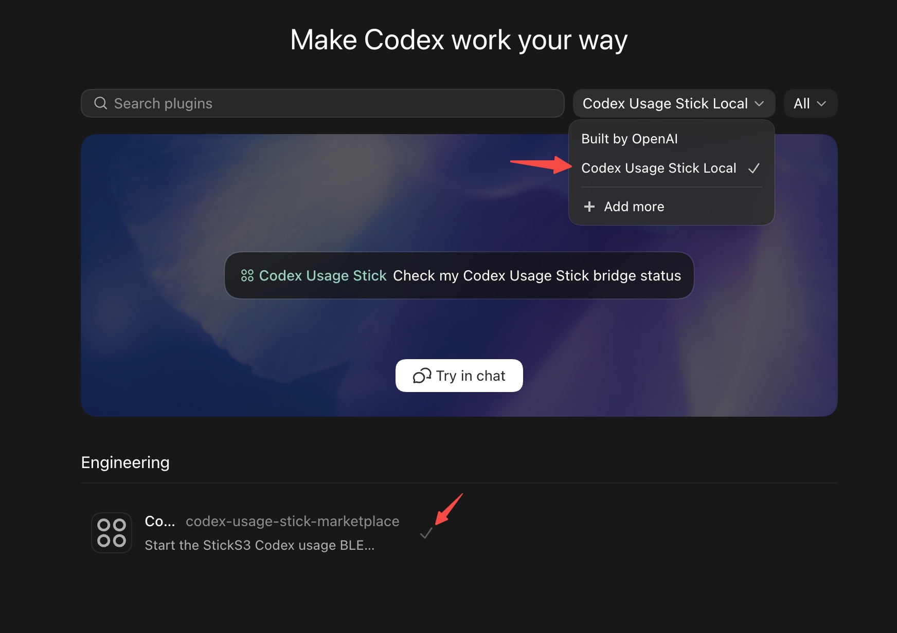

# Codex Buddy

Codex Buddy turns an M5Stack StickS3 into a desktop companion for Codex usage, live states, and animated GIF pets.
It pairs firmware with a local Codex bridge so the device can show usage bars, reset countdowns, and live work-state animations over BLE.

The StickS3 shows Codex usage over BLE: a GIF pet, a weekly remainder forecast,
a weekly remaining-quota bar, reset and gift-expiry countdowns, and live state changes such as `busy`, `idle`,
`completed`, `attention`, `dizzy`, `heart`, and `sleep`.

This project is a personal fork of Anthropic's
[`claude-desktop-buddy`](https://github.com/anthropics/claude-desktop-buddy)
reference firmware. The BLE display idea comes from that reference project,
but this fork is focused on Codex, M5Stack StickS3, GIF pets, and a local Codex
usage bridge.

<p align="center">
  
  
</p>

## What It Displays

- GIF pet area, preserving the landscape pet's 58% scale.
- `WEEK LEFT`: remaining weekly quota (`100 - used`), with a neutral bar.
- `LEFT AT RESET (pp)`: predicted weekly remainder, in percentage points.
- `RESET IN`: time until the automatic weekly reset.
- `GIFT EXP`: the soonest expiry among available Codex reset credits. `--` means
  no known unexpired credit; this display never uses a credit automatically.
- Countdown colors: green above 4 days, amber above 2 days, red otherwise.
- Two forecast triangles: blue above the axis for recent pace (up to 48 hours),
  violet below for longer history (up to 14 days).

Landscape mode places the pet on the left, current quota and countdowns on the
right, and the forecast across the full width underneath. Its title sits below
the axis, with all five numeric labels above it. Portrait mode places the pet
first, current quota and countdowns next, and the forecast at the bottom, with
its title above the axis.

A healthy dashboard has no connection status label. If quota updates fail or the
link drops, valid cached values stay visible, dimmed, with `NO UPDATE` or `NO LINK`
and their observation age. Quota and forecasts expire no later than 15 minutes
after observation or the weekly reset, whichever comes first. Replayed packets,
activity messages, and bridge restarts never extend that lifetime. Without
usable quota, the dashboard replaces the metrics with `NO LINK` / `NO DATA`,
the last observation age (or `--`), and a short instruction to check Bluetooth
or Codex on the Mac. Link presence alone does not prove that quota is fresh.

Both markers use projected usage at the next weekly reset: current usage plus the
observed average consumption rate multiplied by time remaining. They use the
available history after at least one hour of observations; there is no 14-day
waiting period. The displayed remainder is `100 - projected usage`: positive
on the right, negative on the left. The symmetric `log1p(abs(remainder))` scale
is most sensitive near zero and extends from -50 to +50 pp. Small ticks mark
1–5, 20, 30 and 40 on each side (7 pixels tall); the labelled +/-10 and +/-50
ticks are 13 pixels tall, matching the white zero tick. In portrait, +/-10 labels
sit below the axis to leave more space between labels; in landscape, all labels
sit above it.

The 5-by-10-pixel triangles point toward the axis. Beyond either limit they
rotate outward and shift 5 pixels beyond the end tick, without extra numbers.
Exactly +/-50 remains a vertical triangle. Separate upper/lower positions keep
both forecasts visible even when they coincide. When neither forecast is valid,
the panel shows `NO FORECAST`; missing data never appears as a zero remainder.
The weekly remainder bar has no forecast markers. The -50 endpoint is muted red,
+50 is muted green, and zero is white. `COLLECTING HISTORY` is only shown during
forecast warmup; other unavailable forecasts do not imply that waiting will fix them.

The bridge keeps an atomically written `quota_history.json` in
`${CODEX_HOME:-$HOME/.codex}/codex-usage-bridge`. Fresh observations contribute
measured consumption and covered time to five-minute buckets. Retention is
14 days by observation time, independent of how many quota resets occur;
reset events cannot evict recent history from a fixed-size observation ring.
On startup, it can seed missing history from the
rollout records it already reads, but only for the current, live-confirmed
weekly cycle and matching limit. Older cycles are not imported. Duplicate
records, percentage decreases, and reset timestamp rounding are handled before
calculating rates. Both scheduled and manual quota resets preserve the rolling
history: only the interval straddling a reset is excluded from consumption and
observed time. Forecasts immediately use the retained rate with the new quota
and reset deadline; they do not restart the one-hour warmup.

The reconciler remembers the highest observed counter for each known quota
window. Returning to an older window starts a new continuity segment without
counting its previous consumption again. This handles both delayed old replies
after a real reset and an isolated false zero followed by the original window.
The interval crossing a window switch has unknown consumption and is excluded.
An unused window can move its deadline until first use; deadline movement alone
does not manufacture consumption. A counter below its window's remembered
high-water mark remains ambiguous and cannot train the forecast. Responses
matching multiple windows within timestamp rounding tolerance are also
excluded until the window can be identified unambiguously.

History format v3 separates window reconciliation from the rolling consumption
ledger. Existing v1/v2 observations are validated and replayed through the same
reconciler before migration, repairing repeated old-window counters that remain
in those observations. The upgrade is written atomically after an accepted live
observation. Migration cannot recreate records already lost by an older bridge.
The BLE forecast fields are unchanged; this update requires restarting the
Python bridge and no firmware flash.

Fourteen days is the retention window, not invented coverage: a new installation
or a recovered partial history initially has fewer days available. The long
forecast uses that available span, subject to the same coverage checks. Account
changes, missing observations, and discarded corrupt data cannot be replaced
with assumed zero usage or another account's unscoped logs.

History is scoped to the quota limit and a fingerprint of the account email
and plan returned by `account/read`; routine credential refreshes preserve it.
Only the fingerprint is stored, not email or credentials. Account/plan changes
start a separate history, and unavailable identity temporarily hides forecasts.
The API does not expose a workspace identifier, so workspaces with the same
email and plan cannot be distinguished. Initial log bootstrap excludes records
older than the authentication file's modification time. Existing file-metadata
history keys are migrated only when they still match that file.

Forecasts are approximate: quota percentages are rounded, unobserved reset
boundaries have unknown consumption, and usage at the 100% ceiling does not
measure additional demand. A same-cycle gap has a known total change, but gaps
over six hours are retained as whole intervals and are not interpolated across
a forecast window boundary. Short intervals are aggregated in five-minute
buckets; continuous boundary buckets use proportional coverage at that
resolution. Partially queried buckets containing unknown intervals are
excluded rather than assigned invented coverage. Markers
are omitted if less than 80% of the available span is usable or if their
validity time expires (at most 15 minutes,
and never beyond the quota reset). Missing/corrupt history does not interrupt
the ordinary usage display. Collection follows the existing BLE bridge
lifecycle, so an offline device can leave gaps in history.

## Hardware

Tested target:

```text
M5Stack StickS3 / ESP32-S3
```

## Quick Start

For a full walkthrough, use [docs/USAGE.md](docs/USAGE.md).
Remember to install PlatformIO before building or flashing the firmware.

### 1. Build And Flash Firmware

```bash
git clone https://github.com/openelab-commits/codex-buddy.git
cd codex-buddy
pio run -e m5stack-sticks3
pio run -e m5stack-sticks3 -t upload
pio run -e m5stack-sticks3 -t uploadfs
```

When flashing firmware or uploading filesystem data, hold the lower-left side
button to enter flashing mode. Short-press twice to power off, and short-press
once to power on.

### 2. Install The Codex Plugin

Install Python BLE support:

```bash
python3 -m pip install bleak
```

In Codex, open:

```text
Settings -> Plugins -> Add plugin marketplace
```

Fill the dialog like this:

```text
Source:
openelab-commits/codex-buddy

Git ref:
main
```

<p align="center">
  
</p>

Choose `Codex Usage Stick Local` and add it.

<p align="center">
  
</p>

If you publish this under your own fork, use your own GitHub `owner/repo` in
the `Source` field.

Open a new Codex window, type `$codex-usage-stick`, choose the plugin skill,
and send this prompt:

```text
Help me enable hooks and generate three corresponding hooks: SessionStart, UserPromptSubmit, and PermissionRequest. They need to be triggered both inside and outside the project.
```

Codex should create the three hooks that start the BLE bridge.

CLI fallback:

Make plugin_hooks = true on bash:

```bash
/Applications/Codex.app/Contents/Resources/codex features list | grep plugin_hooks
```

if it turns out:
```bash
plugin_hooks    under development    true
```
plugin_hooks = true, if not
Enable plugin hooks on bash:

```bash
/Applications/Codex.app/Contents/Resources/codex features enable plugin_hooks
```


 Confirm the plugin is enabled:

```bash
grep -n 'codex-usage-stick' ~/.codex/config.toml
```
Normally turn out:
```bash
[plugins."codex-usage-stick@codex-usage-stick-marketplace"]
enabled = true
```

If the plugin does not enable automatically, add this to `~/.codex/config.toml`:

```bash
open -a TextEdit ~/.codex/config.toml
```

add this at the end:

```toml
[plugins."codex-usage-stick@codex-usage-stick-marketplace"]
enabled = true
```

Restart Codex. When Codex asks whether to trust the hooks, approve them. The
hooks start a local BLE bridge and forward permission prompts to the StickS3;
they do not send data to an external server.

```bash
/Applications/Codex.app/Contents/Resources/codex plugin marketplace add openelab-commits/codex-buddy --ref main
```

### 3. Trigger The Bridge

After Codex restarts, make sure Bluetooth is enabled on the computer.
Send any message in Codex. Codex will try to connect to the hardware and the
StickS3 should show a pairing code.

CLI fallback:

For the first BLE pairing on a new computer, start with a foreground `busy`
test so macOS can show the pairing prompt:

```bash
python3 ~/.codex/plugins/cache/codex-usage-stick-marketplace/codex-usage-stick/0.4.0/scripts/codex_usage_ble_bridge.py --verbose --state busy
```

The StickS3 should show a pairing code. Enter that code on the computer to
finish the BLE pairing. Once the hardware starts showing usage information,
stop the foreground test with `Command-C` / `Ctrl-C`.

Then submit any prompt in a project where the plugin hook is trusted. The
plugin hook should start the BLE bridge automatically.

Check hook startup:

```bash
tail -n 20 "${CODEX_HOME:-$HOME/.codex}/codex-usage-bridge/hook.log"
```

You should see `UserPromptSubmit`.

When Codex asks for a permission approval, the StickS3 should show an approval
panel. Press A to allow or B to deny. If the StickS3 is offline, Codex falls
back to the normal local approval prompt.

Check BLE packets:

```bash
tail -n 40 "${CODEX_HOME:-$HOME/.codex}/codex-usage-bridge/bridge.log"
```

A healthy log contains lines like:

```text
sent {"state":"busy","tokens":...,"primary":...,"secondary":...}
```

### 4. Move The Stick To Another Computer

The StickS3 connects over BLE, not Wi-Fi. To move the same StickS3 to another
computer, first stop the bridge on the old computer or quit Codex:

```bash
cd codex-buddy
python3 plugins/codex-usage-stick/scripts/start_bridge.py --stop
```

Then open Codex on the new computer, install and trust the plugin, and submit
any prompt. The `UserPromptSubmit` hook starts the local BLE bridge and connects
to the StickS3.

If it does not connect, restart the StickS3 and check the new computer's bridge
log:

```bash
tail -n 80 "${CODEX_HOME:-$HOME/.codex}/codex-usage-bridge/bridge.log"
```

A StickS3 should be connected to one computer at a time. If the old computer is
still running the bridge, the new computer may see the device but fail to claim
the BLE connection.

## Current Status

This is a working prototype.

Tested:

- M5Stack StickS3 firmware build and upload.
- BLE advertising as `Codex-XXXX`.
- Codex usage packets sent from macOS to StickS3.
- Portrait usage dashboard.
- Landscape usage dashboard.
- Landscape GIF rendering through a small canvas to avoid slow direct LCD
  pixel drawing.
- Local Codex plugin startup on `SessionStart` and `UserPromptSubmit`.
- Local Codex `PermissionRequest` hook forwarding to StickS3.
- StickS3 approve/cancel handling for Codex permission prompts.
- Hook diagnostics and bridge diagnostics.

Testing:

- A polished public pet-generation pipeline. GIF pet creation is still a work
  in progress.

## Packet Format

The bridge sends compact JSON over BLE:

```json
{
  "state": "busy",
  "tokens": 57832,
  "primary": 1,
  "secondary": 16,
  "primary_resets_at": 1778673005,
  "secondary_resets_at": 1779159360,
  "quota_status": "fresh",
  "quota_observed_at": 1778671200,
  "quota_valid_until": 1778672100,
  "secondary_forecast_status": "learning",
  "gift_reset_expires_at": 0,
  "gift_observed_at": 1778671200,
  "now": 1778671200
}
```

Quota fields are sent as complete value/reset pairs. A pair is omitted when
OpenAI does not report that window; the firmware renders it as unavailable.

| Field | Meaning |
| --- | --- |
| `state` | Pet state: `busy`, `idle`, `completed`, `attention`, `dizzy`, `heart`, or `sleep` |
| `tokens` | Total token usage value read by the bridge |
| `primary` | Optional 5-hour usage percentage |
| `secondary` | Optional 7-day usage percentage |
| `primary_resets_at` | Optional Unix timestamp for primary reset |
| `secondary_resets_at` | Unix timestamp for secondary reset |
| `now` | Sender timestamp used to synchronize the device clock |
| `quota_status` | `fresh`, `cached`, or `unavailable`; independent of link/activity |
| `quota_observed_at` | Unix time of the actual quota observation; retained across replay/restart |
| `quota_valid_until` | Quota expiry, capped at observation + 15 minutes and the weekly reset |
| `gift_reset_expires_at` | Earliest available reset credit expiry; 0 confirms none; omitted means unknown |
| `gift_observed_at` | Unix time when credit metadata was observed |
| `secondary_forecast_status` | `ready`, `learning` (initial warmup), or `unavailable` |
| `secondary_forecast_48h` | Legacy integer projected usage: 0–100, or 101 for overflow |
| `secondary_forecast_14d` | Legacy integer projected usage: 0–100, or 101 for overflow |
| `secondary_remaining_48h_bp` | Optional signed remainder in hundredths of a percentage point, -5100 to +5100 |
| `secondary_remaining_14d_bp` | Same unit, using the longer history window |
| `secondary_forecast_valid_until` | Unix expiry timestamp required to display forecast markers |

For example, `-125` means a predicted deficit of 1.25 pp. Remainders strictly
outside +/-50 pp are encoded as +/-5100 before rounding, preserving the
distinction between a boundary and an overflow. Precision of transmission does
not imply accuracy of the underlying estimate.

Old firmware ignores the added freshness/credit fields and keeps using the legacy
forecasts. New firmware clears missing fields on every quota packet. With an old
bridge it shows `NO DATA`: freshness cannot be inferred safely from repeated
quota values or activity timestamps. Updating this feature requires both the bridge and firmware, without
uploading the pet filesystem. The five-hour fields remain in the protocol and
diagnostic pages, but are no longer displayed on the home dashboard.

Forecast verification (no device required):

```bash
pio run -e m5stack-sticks3
PYTHONDONTWRITEBYTECODE=1 python3 -m unittest discover -s plugins/codex-usage-stick/tests -v
```

The firmware tests compile the production snapshot parser, state model, and
renderer directly, using a recording graphics surface and PlatformIO ArduinoJson
headers. They check field validation, expiry, cached/offline states, scale
monotonicity, marker direction, text/pixel bounds in both orientations, tick
heights, and the unmarked weekly remainder bar. These checks require a C++ compiler;
otherwise the host firmware checks are reported as skipped.

## GIF Character Pack Format

A character pack is a folder containing `manifest.json` and GIF files.

Pet state meanings:

| State | Meaning |
| --- | --- |
| `sleep` | Codex has not been used for a long time |
| `idle` | Normal state |
| `busy` | Codex is running |
| `attention` | Codex sent a permission request |
| `completed` | Task completed |
| `celebrate` | Reserved for pet upgrades; currently not called |
| `dizzy` | Triggered by shaking the device |
| `heart` | Triggered by pressing B on the normal screen |

Example:

```json
{
  "name": "Mao",
  "states": {
    "sleep": "sleep.gif",
    "idle": ["idle_0.gif", "idle_1.gif"],
    "busy": "busy.gif",
    "attention": "attention.gif",
    "completed": "completed.gif",
    "celebrate": "celebrate.gif",
    "dizzy": "dizzy.gif",
    "heart": "heart.gif"
  }
}
```

Place character folders under `data/characters/`, for example:

```text
codex-buddy/data/characters/Mao/
```

To update the pet assets, open Terminal in the `codex-buddy` directory
and run:

```bash
pio run -e m5stack-sticks3 -t uploadfs
```

When flashing firmware or uploading filesystem data, hold the lower-left side
button to enter flashing mode. Short-press twice to power off, and short-press
once to power on.

Recommended source animation target:

- 144x156 frames.
- Transparent background.
- Consistent character design across all states.
- No text, UI elements, shadows, or complex scenery inside the GIF.
- Keep the pack small enough for LittleFS.

## Troubleshooting

Use the full guide in [docs/USAGE.md](docs/USAGE.md#troubleshooting).

Common checks:

```bash
python3 plugins/codex-usage-stick/scripts/start_bridge.py --status
tail -n 20 "${CODEX_HOME:-$HOME/.codex}/codex-usage-bridge/hook.log"
tail -n 40 "${CODEX_HOME:-$HOME/.codex}/codex-usage-bridge/bridge.log"
```

If Codex shows a hook warning about async hooks, update to this version. The
plugin hooks in this repo are synchronous and quickly start a background bridge.

If first-time Bluetooth pairing fails, or the bridge log shows
`Peer removed pairing information`, reset the macOS BLE pairing record:

1. Open macOS `System Settings -> Bluetooth`.
2. Find the `Codex-XXXX` device and choose `Forget This Device`.
3. Turn Mac Bluetooth off and on again.
4. Restart the StickS3.
5. Submit a prompt in Codex to let the plugin reconnect.

## Credits

Made by OpenELAB Cris.

Forked from the Claude Desktop Buddy reference firmware by Felix Rieseberg and
Anthropic.

## License

This fork keeps the upstream project license. See [LICENSE](LICENSE).
